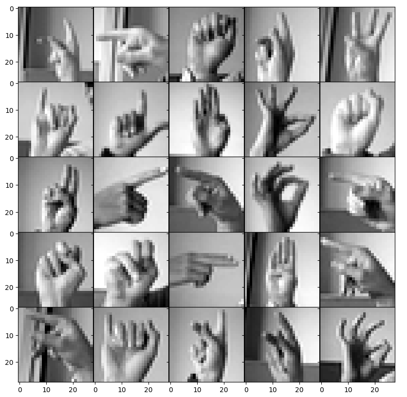
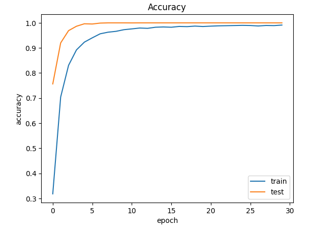

# Hand Gesture Classification for Sign Language 

A Convolutional Neural Network (CNN) model to recognize American Sign Language (ASL) letters from grayscale hand gesture images. Trained on the Sign Language MNIST dataset, this model achieves over 93% test accuracy.


## Overview

This project builds a classifier to recognize 26 letters of the English alphabet in ASL from 28x28 pixel grayscale images. We use a CNN built with Keras to process the input images and output letter predictions. The model is trained and validated on labelled image data and evaluated for performance on a held-out test set.


## Project Structure
```text
.
├── images/                      
│   ├── sample_images.png        # Visualization of sample sign language images
│   └── training_accuracy.png    # Accuracy plot of training vs. validation
├── sign_language.ipynb          # Jupyter notebook for interactive development and experimentation
├── sign_language.py             # Python script version for reproducible training and evaluation
├── data/                        # Folder to hold the dataset csv files
|  ├── train.csv                 # Training dataset (MNIST Sign Language)
|  └── test.csv                  # Testing dataset (MNIST Sign Language)
├── requirements.txt             # Required Python packages
└── README.md                    
```

## Features

- CNN model trained using Keras on sign language images
- Achieves 93.67% accuracy on the test set
- Includes real-time testing with unseen test images
- Visualizes training and validation accuracy over epochs
- Displays sample images to understand the dataset


## Dataset

- Source: [Kaggle – Sign Language MNIST](https://www.kaggle.com/datasets/datamunge/sign-language-mnist)
- Shape:
  - `train.csv`: 27,455 samples  
  - `test.csv`: 7,172 samples  
- Format:
  - Each sample is a flattened `28x28` grayscale image (784 features)  
  - Labels range from `0–25`, corresponding to letters `A–Z`


## Usage

1. Install dependencies:
   ```bash
   pip install -r requirements.txt
   ```
2. Run the notebook or script:
- In Jupyter Notebook: run all cells in `sign_language.ipynb`.
- In terminal:
  ```bash
  python sign_language.py
  ```
Make sure the dataset CSVs `train.csv` and `test.csv` are in the same directory.

## Accuracy
- Test Accuracy: 93.67%
- Epochs Trained: 30
- Batch Size: 128

## Visual Outputs
- **Sample Training Images**



- **Training Accuracy Plot**



## Notes
- The model is a simple CNN with two Conv2D + MaxPooling layers, followed by Dense and Dropout layers.
- Achieves around 93.7% accuracy on the test set after 30 epochs.
- Data is normalized and labels are one-hot encoded.
- Training uses an 80/20 train-validation split.
- Possible improvements:
    - Add data augmentation for better generalization.
    - Use transfer learning for potentially higher accuracy.
    - Implement a real-time gesture recognition interface.
    - Include confusion matrix and other evaluation metrics.
    - Experiment with hyperparameter tuning.
